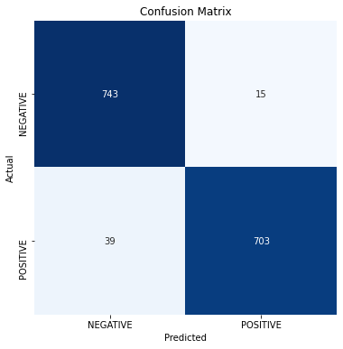

# CRACK DETECTION & CLASSIFICATION
It is essential to keep an eye on the state of the buildings in order to reduce the cost of the repairs brought on by repairing the walls over time. Crack on walls are not just a termite killing the walls but also a Hazard in the long run. Finding cracks in the walls in a timely and correct manner is beneficial for determining the stability of the walls, enhancing the quality of walls maintenance, and having a significant impact on ensuring that the residents and neighbourhood are kept safe. This is not the only problem at hand, the walls can withstand cracks for years but the severity of these walls must be determined to ensure the time when repairs are to be made.


## Objectives


**Objective 1 :** To identify if a given image has a crack or not (Crack Detection).

**Objective 2 :** To classify the identified crack as light, moderate, severe or plaster damage (Crack Classification).

## Objective 1 : Crack Detection


### Dataset
The Dataset was taken from the following source :

[Özgenel, Çağlar Fırat (2019), “Concrete Crack Images for Classification”, Mendeley Data, v2](https://data.mendeley.com/datasets/5y9wdsg2zt/2)

This dataset contains about **40,000** images out of which we have **20,000 crack images** and **20,000 non-crack images**.

To reduce the training time and keeping available resources in mind we have only taken a sample of **5000 images**.


### Model

The model uses convolutional neural networks or CNNs which consist of the following layers : 

+ Conv2D layers
+ MaxPooling layers
+ GlobalAveragePooling2D layers
+ Dense layer (for output)


```
inputs = tf.keras.Input(shape=(120, 120, 3))
x = tf.keras.layers.Conv2D(filters=16, kernel_size=(3, 3), activation='relu')(inputs)
x = tf.keras.layers.MaxPool2D(pool_size=(2, 2))(x)
x = tf.keras.layers.Conv2D(filters=32, kernel_size=(3, 3), activation='relu')(x)
x = tf.keras.layers.MaxPool2D(pool_size=(2, 2))(x)
x = tf.keras.layers.GlobalAveragePooling2D()(x)
outputs = tf.keras.layers.Dense(1, activation='sigmoid')(x)

model = tf.keras.Model(inputs=inputs, outputs=outputs)

```

The images were resized to **120 x 120 pixels** to speed up training.

The model summary is as follows :


```
Model: "model_2"
_________________________________________________________________
Layer (type)                 Output Shape              Param #   
=================================================================
input_3 (InputLayer)         [(None, 120, 120, 3)]     0         
_________________________________________________________________
conv2d_4 (Conv2D)            (None, 118, 118, 16)      448       
_________________________________________________________________
max_pooling2d_4 (MaxPooling2 (None, 59, 59, 16)        0         
_________________________________________________________________
conv2d_5 (Conv2D)            (None, 57, 57, 32)        4640      
_________________________________________________________________
max_pooling2d_5 (MaxPooling2 (None, 28, 28, 32)        0         
_________________________________________________________________
global_average_pooling2d_2 ( (None, 32)                0         
_________________________________________________________________
dense_2 (Dense)              (None, 1)                 33        
=================================================================
Total params: 5,121
Trainable params: 5,121
Non-trainable params: 0
_________________________________________________________________
```


The model was trained for **100 epochs** with an **EarlyStopping callback**


## Evaluation & Results


The model was evaluated and the results are as follows : 

+ The model after training had a **validation accuracy of 98%**
+ A heatmap of the confusion matrix was plotted to draw observations about the model's performance



Here NEGATIVE refers to the images without cracks and POSITIVE refers to the images with cracks.

+ The classification metrics for the model were calculated for as follows : 
  
```
  ----------------------
  Classification Report:
  ----------------------

               precision    recall  f1-score   support

    NEGATIVE       0.95      0.98      0.96       758
    POSITIVE       0.98      0.95      0.96       742
    accuracy                           0.96      1500
   macro avg       0.96      0.96      0.96      1500
weighted avg       0.96      0.96      0.96      1500
```
